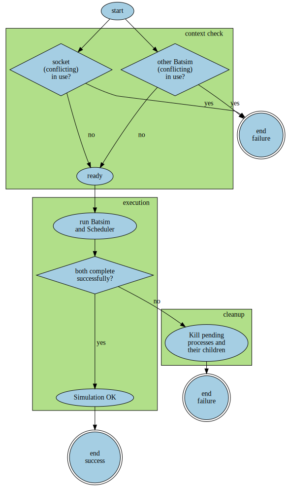

A set of experimental tools around the
[Batsim simulator](https://github.com/oar-team/batsim).

# robin

robin is a program in charge of managing one Batsim simulation.

## Why?
A batsim simulation involves several processes that communicate with each other.

Executing these processes manually can be tricky, bothersome and risky,
as many problems may rise:
- One process got bad arguments and stopped. The other one is waiting forever.
- One process crashed. The other one is waiting forever.
- The simulation is launched but another one is already running.
- ...

The main goal of this script is to facilitate the execution of one single
simulation instance so it can be seen as a black box with inputs and outputs.

## How does it work?
The main idea behind Robin is shown on the figure below.

